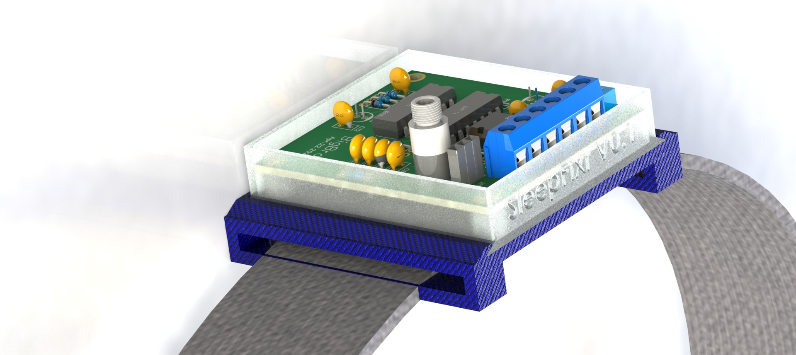
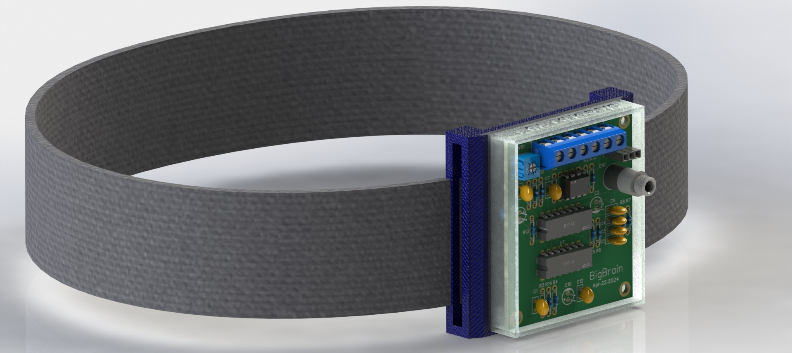

# SleepFixr V0.1

A short description of what the project does and its purpose.

## Tech Stack

- **Cloud Platform:** [AWS](https://aws.amazon.com/), [Microsoft Azure](https://azure.microsoft.com/), [DigitalOcean](https://www.digitalocean.com/) (Choose one or more)
- **Infrastructure as Code (IaC):** Terraform (or another IaC tool)
- **Container Orchestration:** Docker Compose (or another container orchestration tool)
- **Version Control:** Git
- **CI/CD:** GitHub Actions
- **API Design:** (Define the type of API used here, e.g. REST, gRPC)
- **Database:** MongoDB (or another database)
- **Frontend Framework:** ReactJS, NextJS (or another frontend framework)
- **Backend Framework:** Flask (or another backend framework)
- **IoT Hardware:** Arduino, ESP32 (or other IoT hardware)
- **IoT Communication Protocol:** MQTT (or another IoT communication protocol)
- **Visualization Platform:** ThingsBoard (or another visualization platform)

## Getting Started

This section should provide instructions on how to setup and run the project.

- Prerequisites:
  - ...
- Installation:
  - ...
- Running the Project:
  - ...

## Deployment

This section should provide instructions on how to deploy the project to production.

- ...

## Contributing

This section should provide instructions on how to contribute to the project.

- ...

## License

The license under which the project is distributed.

## Authors

- ...
