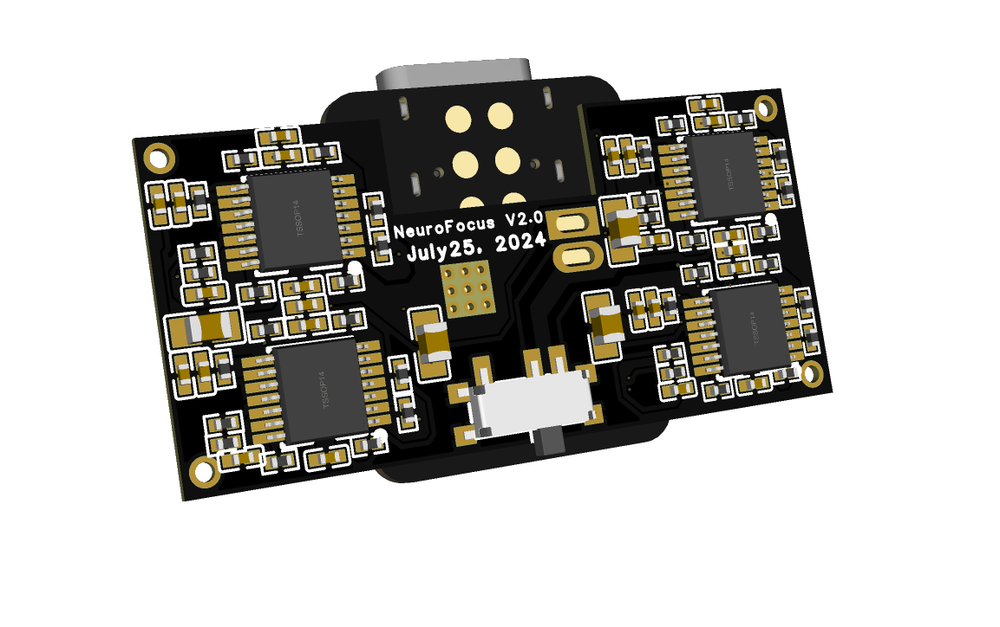

# Neurofocus EEG with Arduino Nano and BT5 Module Project

### Images:

{: width="400px" height="300px"}

This repository contains the SolidWorks CAD files for the Neurofocus EEG project, which utilizes an Arduino Nano and a BT5 module. The project aims to develop a portable and affordable EEG (Electroencephalogram) device for neurofeedback and brainwave monitoring.

## Features

- Compact and lightweight design
- Arduino Nano for data acquisition and processing
- BT5 module for wireless data transmission
- SolidWorks CAD files for easy customization and 3D printing

## Getting Started

To get started with the Neurofocus EEG project, follow these steps:

1. Clone the repository to your local machine.
2. Open the SolidWorks CAD files in your preferred CAD software.
3. Customize the design according to your requirements.
4. Export the CAD files for 3D printing.
5. Assemble the hardware components, including the Arduino Nano and BT5 module.
6. Upload the Arduino code to the Arduino Nano.
7. Connect the BT5 module to your computer or mobile device.
8. Power on the EEG device and establish a Bluetooth connection.
9. Start collecting and analyzing brainwave data using the provided software.

<!-- ## Documentation

For detailed instructions on using the Neurofocus EEG device, refer to the [User Guide](Documentation/User_Guide.md). If you encounter any issues, please consult the [Troubleshooting](Documentation/Troubleshooting.md) guide for possible solutions. -->

## Contributing

Contributions to the Neurofocus EEG project are welcome! If you have any improvements or bug fixes, feel free to submit a pull request.

<!-- Please refer to the [Contribution Guidelines](CONTRIBUTING.md) for more information. -->

## License

This project is licensed under the [MIT License](LICENSE).
