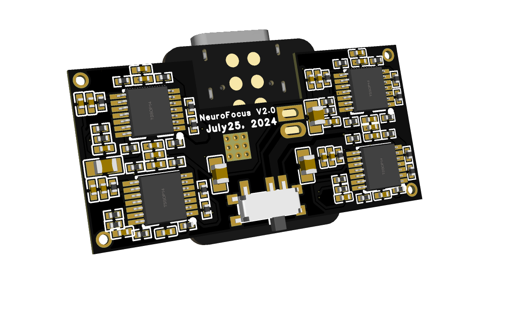

# NeuroFocus V2.0 - ESP32C3 Xiao Board with TL084PW Chip and 8-Channel EEG

### Images:

{: width="400px" height="300px"}

This repository contains the hardware design files and software for the NeuroFocus EEG project, which utilizes an ESP32C3 Xiao board with an integrated TL084PW chip for 8-channel EEG data acquisition. The project aims to develop a portable and affordable EEG (Electroencephalogram) device for neurofeedback and brainwave monitoring.

## Features

- Compact and lightweight design
- ESP32C3 Xiao board for data acquisition and processing with integrated Wi-Fi and Bluetooth connectivity
- TL084PW chip for amplifying and filtering 8-channel EEG signals
- Open-source software for data collection, analysis, and visualization

## Getting Started

**Hardware Requirements:**

* ESP32C3 Xiao board
* TL084PW chip and supporting circuitry (resistors, capacitors, etc.)
* Electrodes (8 channels)
* Additional hardware components (battery, wires, etc.)

**Software Requirements:**

* Arduino IDE (or similar development environment)
* EEG signal processing libraries (to be specified)

**Assembly Instructions:**

1. Download and review the hardware schematics and PCB layout files.
2. Source the required electronic components.
3. Assemble the hardware components according to the schematics.
4. Install the necessary libraries and software onto your development machine.
5. Upload the Arduino code to the ESP32C3 Xiao board.
6. Connect the electrodes and ensure proper placement.

**Software Features (placeholder, to be developed):**

* Real-time data acquisition and visualization
* Basic signal processing (filtering, noise reduction)
* Feature extraction (e.g., power spectral density)
* Potential for neurofeedback applications (to be explored)

**Note:** Software development is ongoing. Refer to the latest code and documentation for specific functionalities.

## Contributing

Contributions to the NeuroFocus EEG project are welcome! If you have any improvements or bug fixes for the hardware design or software, feel free to submit a pull request.

## License

This project is licensed under the [MIT License](LICENSE).